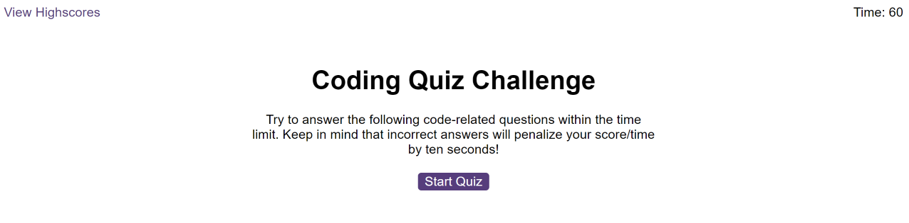
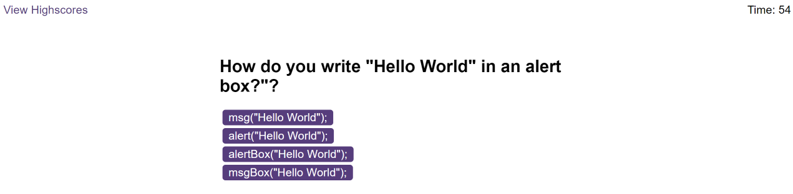
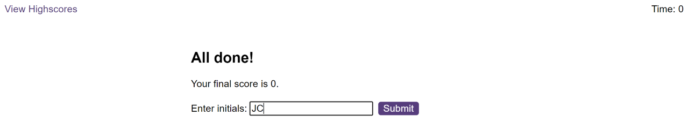

# Console-Finances
A web site with quiz who will test your knowledge in the JavaScript language.

## Instructions

Open the index.html into your browser and click 'Start' to start a new quiz. Try and answer the questions before time runs up, but careful! Every wrong answer will take 10 seconds out of the timer. At the end, enter your initials to save your score. You can also check the score table by using the link on top left side 'View Score'.

You can find live preview in this link : [Preview](https://joekrstevskigj.github.io/Quiz-For-Developers-JS/)

### Screenshot 1 ###
A screenshot of the start page of the quiz.

### Screenshot 2 ###
A screenshot of a sample of the question.

### Screenshot 3 ###
End game screenshot.

